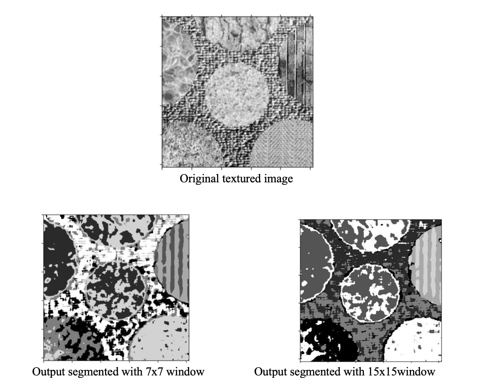

# Texture-Classification-and-Segmentation-using-k-means-clustering
Texture analysis is an important part of image processing for segmentation and classification of images based on local spatial variation of intensity values. A texture can be defined as similar structures repeated over and over again that helps describing how an image looks like. An efficient description of image texture can help in good classification and segmentation results. However, in reality segmentation is difficult because humans use semantics to group pixels (to recognize the textures) while computers are very weak in semantic understanding. Humans use 3D information to segment textures (like occlusion) while computers have only 2D information. Furthermore, the textures are generally not uniform due to changes in scale, intensity values and orientation.

